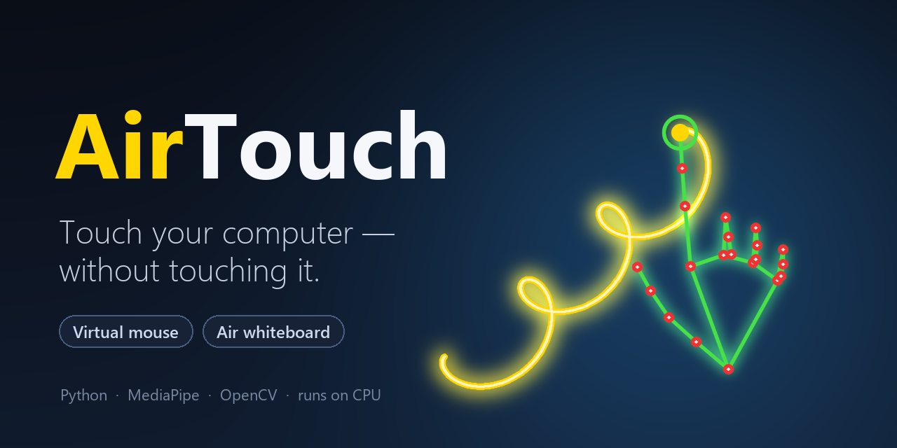

<p align="center">
  
</p>

<p align="center">
  <b>Control your mouse and write on a virtual whiteboard with nothing but your hand and a webcam.</b><br>
  Real-time hand tracking &nbsp;·&nbsp; ~30 FPS on CPU &nbsp;·&nbsp; no special hardware
</p>

<p align="center">
  <a href="https://github.com/younespuri/AirTouch/actions/workflows/ci.yml"></a>
  
  
  
  <a href="LICENSE"></a>
</p>

<p align="center">
  <a href="#quick-start">Quick start</a> &nbsp;·&nbsp;
  <a href="#gestures">Gestures</a> &nbsp;·&nbsp;
  <a href="#how-it-works">How it works</a> &nbsp;·&nbsp;
  <a href="#roadmap">Roadmap</a>
</p>

<!-- Demo: record ~10s of writing, erasing and cursor control, save it as
     docs/demo.gif, then replace this comment with:   -->

## Why AirTouch?

- **Two tools, one hand.** A virtual mouse and an air whiteboard, one `TAB` apart.
- **No special hardware.** Just the webcam you already have.
- **Feels smooth.** A [One Euro filter](https://gery.casiez.net/1euro/) removes hand tremor without adding lag.
- **Works at any distance.** Every gesture is measured relative to your hand size.
- **Built to last.** Modular, unit-tested with CI, and a new mode is one small class.

## Quick start

```bash
git clone https://github.com/younespuri/AirTouch.git
cd AirTouch
pip install -r requirements.txt
python download_model.py    # one-time, ~7.5 MB hand model
python main.py
```

Raise one finger and write in the air. Open your hand to erase. Press `TAB` to take over your mouse.

> **Tip:** press `B` to dim the camera so your writing glows, and `SPACE` to pause at any time.

Options: `python main.py --mode mouse` starts in mouse mode, `--camera 1` picks another webcam.
Tested on Windows 11 with a standard laptop webcam.

## Gestures

### Air whiteboard
| Gesture / key | Action |
| --- | --- |
| Index finger up | Write |
| Open hand | Erase |
| Two fingers up | Move without drawing |
| Hover a button on the top bar | Pick color / brush size / undo / clear / save |
| `Z` / `C` / `S` | Undo / clear / save to `outputs/` |
| `B` | Dim the camera so strokes stand out |
| `N` / `[` `]` | Next color / thinner, thicker pen |

### Virtual mouse
| Gesture | Action |
| --- | --- |
| Index finger up | Move the cursor |
| Thumb + index pinch | Click (tap) or drag (hold and move) |
| Thumb + middle pinch | Right click |
| Two fingers up, move up/down | Scroll |
| Relaxed hand | Idle |

### Anywhere
| Key | Action |
| --- | --- |
| `TAB` | Switch mode |
| `SPACE` | Pause / resume |
| `Q` or `ESC` | Quit |

## How it works

1. **MediaPipe HandLandmarker** (Tasks API, video mode) finds 21 hand landmarks in every frame, on a downscaled copy for speed.
2. `airtouch/hand.py` turns landmarks into gestures: which fingers are up and how close fingertips are, all normalized by palm size, so gestures stay stable as you move closer or farther.
3. Each mode in `airtouch/modes.py` maps gestures to actions. The virtual mouse maps an *active region* of the frame onto your whole screen and drives the real cursor through **PyAutoGUI**.
4. The cursor passes through a **One Euro filter** (`airtouch/smoothing.py`) that stays calm when your hand is still and responsive when it moves fast.

```
AirTouch/
├── main.py               # capture loop + mode switching
├── config.py             # every tunable parameter in one place
├── download_model.py     # fetches the hand model
├── airtouch/
│   ├── hand.py           # pure hand geometry (no camera/ML deps)
│   ├── hand_tracking.py  # MediaPipe HandLandmarker wrapper
│   ├── modes.py          # MouseMode, WhiteboardMode
│   ├── smoothing.py      # One Euro filter
│   ├── toolbar.py        # on-screen whiteboard toolbar
│   └── hud.py            # on-screen overlay
└── tests/                # pytest suite, runs in CI
```

## Tuning

Everything lives in [`config.py`](config.py):

- **Gestures too eager or too stubborn?** Adjust the matching `*_ratio` (lower = harder to trigger).
- **Handwriting shaky?** Raise `pen_smoothing` (more points averaged = smoother, slightly more lag).
- **Slow machine?** Lower `detection_width`; the display stays full resolution.
- **Cursor feel:** `min_cutoff` and `beta` tune the One Euro filter.

## Tests

```bash
pip install -r requirements-dev.txt
pytest
```

Covers the smoothing filter, hand geometry, the toolbar, whiteboard write / erase / undo, and every
mouse gesture (against a fake mouse). No webcam or model download needed.

## Roadmap

- [ ] Two-hand gestures (zoom, rotate)
- [ ] Record your own custom gestures
- [ ] Shape snapping on the whiteboard (straight lines, circles)
- [ ] Export the whiteboard as a transparent PNG or a video
- [ ] Verified macOS and Linux support

Ideas, bug reports and pull requests are welcome; the roadmap is a good place to start.

## License

[MIT](LICENSE)

<p align="center"><sub>If AirTouch made you smile, a star helps other people find it.</sub></p>
